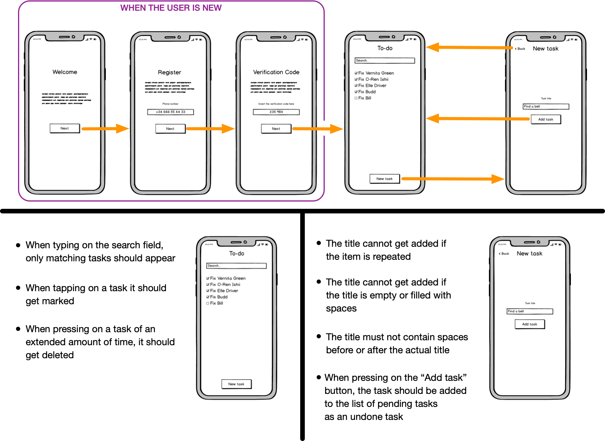

# Authenticated To-do List

This application is the next big thing. Think of it as a Tesla car, but without the wheels, motors or seats; Because a an app with seats would be silly, wouldn't it? Wait! WoaH! That might be a feature for later on, like the next big thing after "the next big thing". Something like the next big big thing, or the next bigger thing. Nevermind, lets focus on the MVP.

So going back to what matters, and this time lets cut to the point. It's an app for those moments when you just feel like getting stuff done, like killing people.

> **A kind message from our laywers:**
>"This mobile application (hereinafter referred to as "app") does not endorse violence, or any type of behaviour that might offend, damage or physically hurt any person, animal, plant and/or insect. The developers of this app will not take responsibility for any type of content, idea and/or execution of any criminal activity while making use of this app"

## What needs to get done

## Problems
- [ ] Integrating native libraries
- [ ] Creating a file-structure
- [ ] Implement a propper navigation
- [ ] Implement a correct flow of properties and states
- [ ] Persist the user data locally
- [ ] Keep the code clean and properly documented

## Tasks
- [ ] Fork this repo
- [ ] Install and configure [`react-native-firebase` (v6)](https://invertase.io/oss/react-native-firebase/quick-start)
- [ ] State management?
- [ ] Code the UI
- [ ] Implement the navigation using `react-navigation` (Already installed)
- [ ] Make use of Firebase-Auth to register and verify the users
- [ ] Push the final code

